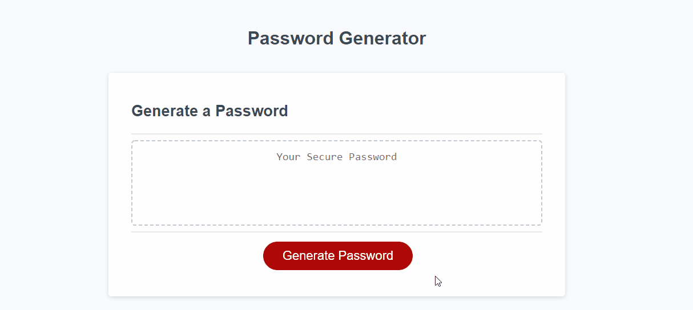
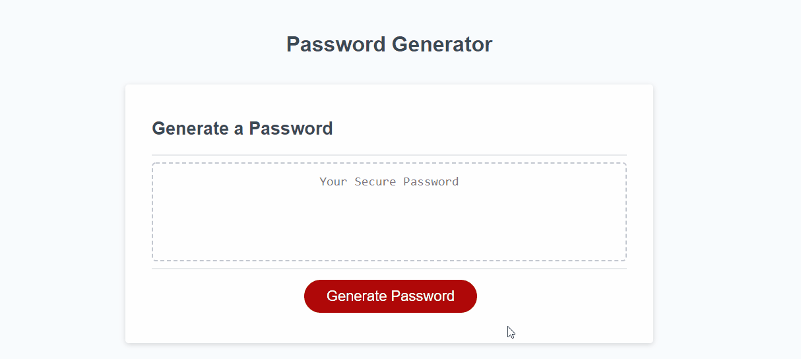

# [Password Generator](https://bryan-thaoxaochay.github.io/Password-Generator/)

## Description

### Purpose
The app generates a password based on prompts given to the user. These prompts include the length of the password and if the password should include lowercase or uppercase letters, numbers, or special characters.

### Technologies Used
- HTML5
- CSS3
- JavaScript

### Future Developments
- Retrieve criteria from checkbox checklist instead of prompts
- User is able to generate a different password based on the previous criteria

## Demonstrations

### Step-by-Step Process
1. Click the red **Generate Password**
2. A prompt will appear asking for the length. Enter a number between 8 and 128 (i.e. **45**)
3. The next prompt will ask if the password should have lowercase letters. Enter either ``Yes`` or ``No``.
4. Repeat step 3 for the following three prompts: **uppercase letters, numbers, special characters**.
5. After answering the last prompt, the password will appear above the **Generate Password** button.

### Example 1

```
Length = 8
Lowercase Letters = Yes
Uppercase Letters = Yes
Numbers = Yes
Special Characters = Yes
```
### Example 2

```
Length = 100
Lowercase Letters = No
Uppercase Letters = No
Numbers = Yes
Special Characters = Yes
```

## License
The MIT License

Copyright (c) 2021 Bryan Thaoxaochay

Permission is hereby granted, free of charge, 
to any person obtaining a copy of this software and 
associated documentation files (the "Software"), to 
deal in the Software without restriction, including 
without limitation the rights to use, copy, modify, 
merge, publish, distribute, sublicense, and/or sell 
copies of the Software, and to permit persons to whom 
the Software is furnished to do so, 
subject to the following conditions:

The above copyright notice and this permission notice 
shall be included in all copies or substantial portions of the Software.

THE SOFTWARE IS PROVIDED "AS IS", WITHOUT WARRANTY OF ANY KIND, 
EXPRESS OR IMPLIED, INCLUDING BUT NOT LIMITED TO THE WARRANTIES 
OF MERCHANTABILITY, FITNESS FOR A PARTICULAR PURPOSE AND NONINFRINGEMENT. 
IN NO EVENT SHALL THE AUTHORS OR COPYRIGHT HOLDERS BE LIABLE FOR 
ANY CLAIM, DAMAGES OR OTHER LIABILITY, WHETHER IN AN ACTION OF CONTRACT, 
TORT OR OTHERWISE, ARISING FROM, OUT OF OR IN CONNECTION WITH THE 
SOFTWARE OR THE USE OR OTHER DEALINGS IN THE SOFTWARE.